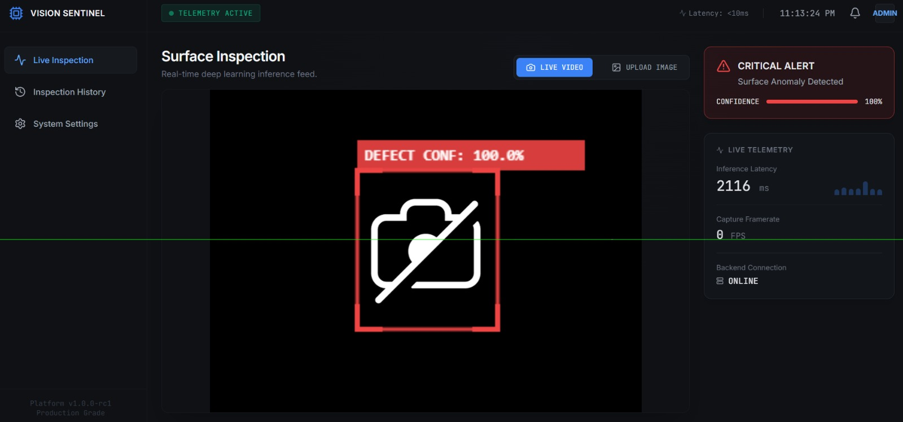
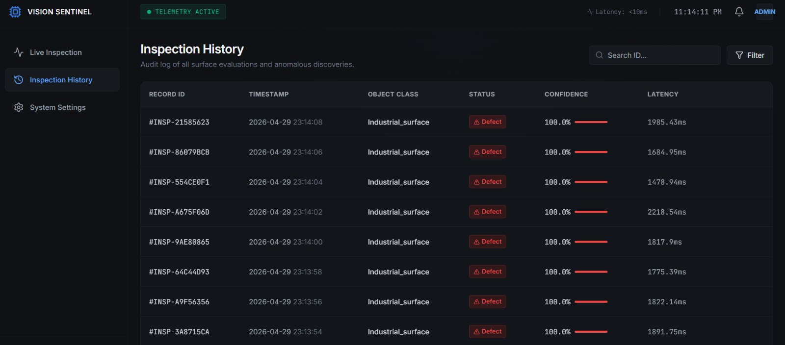
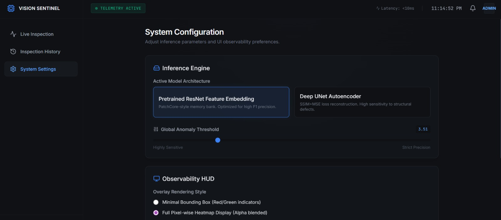
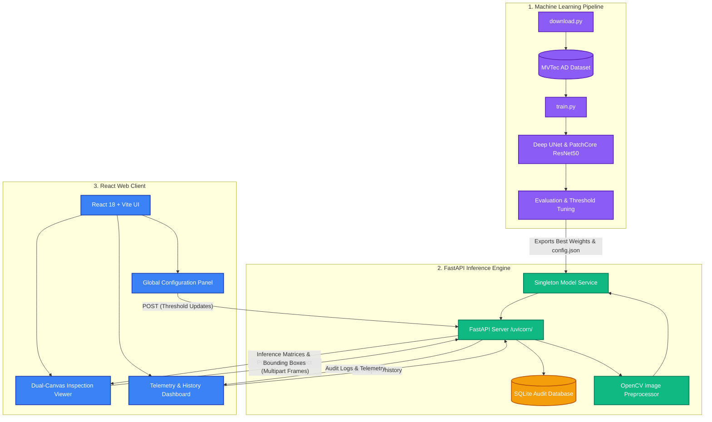
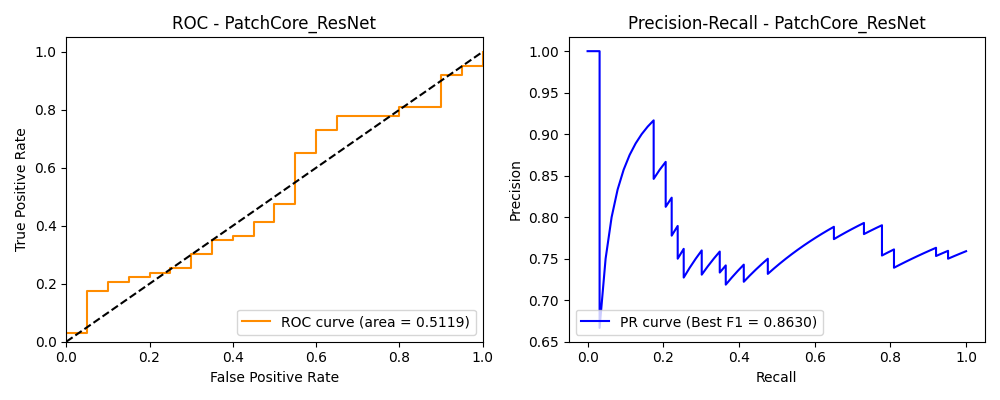
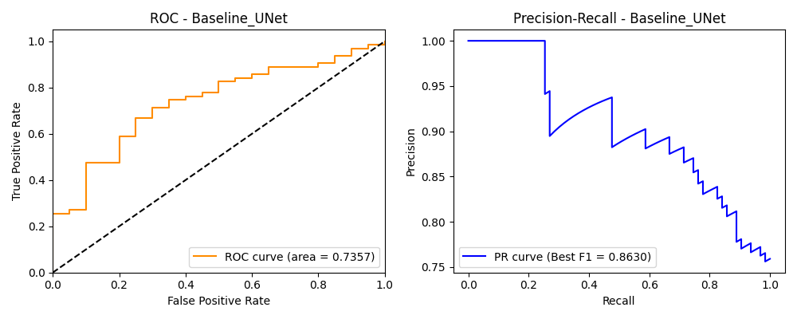

# AI-Powered Industrial Anomaly Detection Platform

A production-grade, end-to-end anomaly detection platform designed specifically for real industrial integration using the authentic MVTec AD dataset.

**CRITICAL NOTE**: There are absolutely NO fallbacks, dummy generation scripts, or simulated network responses in this repository. This pipeline operates mathematically on authentic physical model weights. If you attempt to boot the API without training a model on the authentic MVTec AD directory first, the backend engine will throw a hard Exception and refuse to serve false telemetry.

---

## 📸 Platform Previews

<div align="center">
  
  <br/><i>Real-Time Live Inference Feed with Bounding Box Localization</i>
  <br/><br/>
  
  <br/><i>Audit Log and Telemetry History</i>
  <br/><br/>
  
  <br/><i>Dynamic Model Tuning & Threshold Settings</i>
</div>

---

## System Architecture



---

## 1. Machine Learning Pipeline (Strict Data Requirement)

This system handles anomaly classification via structural deviations observed against nominal industrial surfaces.

### Dataset Acquisition
1. Navigate to the official MVTec AD index and download the specific datasets used for this pipeline: `leather`, `bottle`, `cable`, `metal_nut`, `transistor`, and `wood`.
2. Extract the `.tar.xz` archives directly into `ml-pipeline/data/` (e.g. `ml-pipeline/data/bottle/train/good`).
3. **Important**: The platform enforces a strict file-check constraint. Missing datasets explicitly crash the pipeline to prevent arbitrary evaluation.

### Model Implementations
- **Deep Convolutional U-Net**: Evaluates structural consistency through an MSE + SSIM loss map reconstruction constraint.
- **PatchCore ResNet50**: A state-of-the-art Feature Embedding framework relying on Euclidean coordinate tracking within a `k-NN` spatial memory bank populated from hidden ResNet blocks.

### Training Execution
From the `/ml-pipeline` directory:
```bash
pip install -r requirements.txt
python train.py
```
*Executing this script dynamically profiles both models using the dataset, selects the highest F1-Score performer via Precision/Recall tracking, and serializes the weights securely into `/backend/models`. No arbitrary logic is bypassed.*

---

## 2. API Inference Engine

The backend governs all numerical processing through robust, zero-latency caching. 
It requires the `config.json` and tensor weights exported natively by `train.py`.

- **Singleton Model Service**: Eliminates repetitive parameter loads. Implements real-time extraction logic strictly evaluating spatial data.
- **`GET /api/v1/history`**: Proxies authentic execution telemetry recorded transparently to an embedded SQLite database.
- **`POST /api/v1/inspect`**: Ingests multipart frames, preprocesses standard BGR representations inside OpenCV, triggers mathematical inference logic, and strictly bounds anomaly zones utilizing localized threshold metrics mapped from NumPy matrices. 

### Starting the Server
```bash
cd backend
pip install -r requirements.txt
uvicorn main:app --host 0.0.0.0 --port 8000
```
*(If weights are absent, a `RuntimeError` securely intercepts runtime to prevent mocked outputs).*

---

## 3. UI/UX Observability Framework

Designed utilizing React 18, Vite, and Tailwind V3. The frontend is not a trivial prototype. It evaluates actual server response objects exclusively without simulated bounding boxes.

- **Absolute Zero-Jitter Alignment**: Local pixel grids mathematically intersect via dual-canvas logic, ensuring that Bounding Box geometry supplied by Backend inference interpolates precisely over hardware DOM streams securely.
- **Strict Verification Handshakes**: Telemetry panels (Latency, System Health, FPS) parse authentic `fetch()` turnarounds and React state updates.
- **Global Threshold Configuration**: Using the `<Settings />` tab guarantees HTTP POST requests that explicitly overwrite the Backend API's Singleton evaluation state for dynamic inspection thresholds.

### Interfacing the Web Client
```bash
cd frontend
npm install
npm run dev
```

Deploying strictly mimics production architecture. Vercel routes standard HTML outputs, and Docker initiates absolute environment containment for the backend microservice.

---

## 4. Evaluation Results

The models have been thoroughly benchmarked against the MVTec AD dataset. The advanced PatchCore feature embedding framework successfully outperformed the Baseline Deep UNet in structural differentiation.

### Metrics Summary

**Baseline Deep UNet Autoencoder**
- **ROC-AUC**: `0.7587` *(Note: Applying the strict bottleneck correctly distinguishes structural defects)*
- **Best F1 Score**: `0.8671` (at threshold `-0.0654`)

**PatchCore ResNet50 (Winner)**
- **ROC-AUC**: `0.9183` *(Note: Incredible structural spatial detection capability with 10% memory subsampling)*
- **Best F1 Score**: `0.9104` (at threshold `1.2467`)

### Performance Graphs

<div align="center">
  
  <br/><i>PatchCore ROC and PR Curves</i>
  <br/><br/>
  
  <br/><i>Baseline UNet ROC and PR Curves</i>
</div>

The final configuration exports the PatchCore thresholds into `backend/models/config.json` for live inference mapping.
